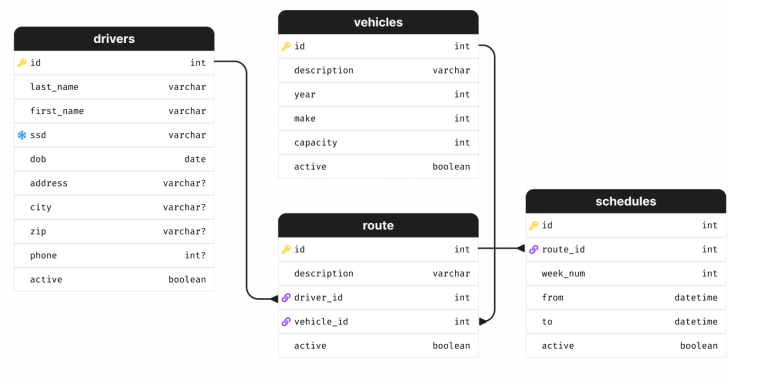

Symfony Api Flota Application
========================

La "Aplicación Api flota"es una aplicación que plantea el siguiente escenario:

Un cliente se acerca a nuestras oficinas con la intención de iniciar un nuevo desarrollo para una
solución que le permita registrar su flota de vehículo y conductores, además contar con un
cronograma de rutas de trabajo por semana.

Diagrama:




Requirements
------------

* Instale PHP 8.1 o superior y estas extensiones de PHP (que están instaladas y habilitadas de manera predeterminada en la mayoría de las instalaciones de PHP 8):
Ctype , iconv , PCRE , Session , SimpleXML y Tokenizer ;
* Instale Composer , que se utiliza para instalar paquetes PHP.

Installation
------------
Una vez descargado el repositorio, procedemos a actualizar el "composer.json", con el siguiente comando :

```bash
$ composer update
```
Configuramos nuestra base de datos en el archivo ".env":

```bash
DATABASE_URL="mysql://root:@127.0.0.1:3306/api-flota"
```

Procedemos a crear la base de datos con el siguiente comando:

```bash
$ php bin/console doctrine:database:create
```

Generamos el archivo de migracion con el siguiente comando:

```bash
$ php bin/console make:migration
```

Procedemos a migrar el archico de migracion con este comando:

```bash
$ php bin/console doctrine:migrations:migrate
```

[Descarga Symfony][4] para instalar el binario de Symfony en tu computadora y ejecuta este comando para iniciar el servidor web:

```bash
$ symfony server:start
```

Luego acceda a la aplicación en su navegador en el lugar indicado URL (<https://localhost:8000>).


